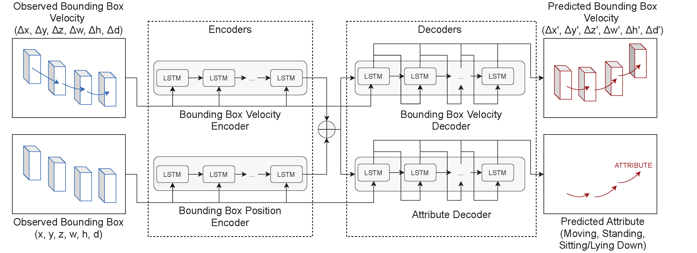
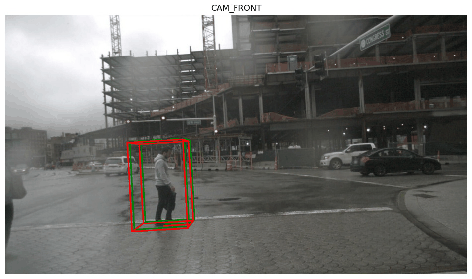

# Pedestrian 3d Bounding Box Prediction


## Abstract
Safety is still the main issue of autonomous driving, and in order to be globally deployed, they
need to predict pedestrians’ motions sufficiently in advance. While there is a lot of research on
coarse-grained (human center prediction) and fine-grained predictions (human body keypoints
prediction), we focus on 3D bounding boxes, which are reasonable estimates of humans without
modeling complex motion details for autonomous vehicles. This gives the flexibility to predict in
longer horizons in real-world settings. We suggest this new problem and present a simple yet effective
model for pedestrians’ 3D bounding box prediction. This method follows an encoder-decoder
architecture based on recurrent neural networks, and our experiments show its effectiveness in
both the synthetic (JTA) and real-world (NuScenes) datasets. The learned representation has useful
information to enhance the performance of other tasks, such as action anticipation.

This project uses the [Joint Track Auto (JTA)](https://github.com/fabbrimatteo/JTA-Dataset) and the [NuScenes](https://www.nuscenes.org/) datasets.


## Introduction:
This is the official code for the paper ["Pedestrian 3D Bounding Box Prediction"](https://arxiv.org/abs/2010.10270), accepted and published in [hEART 2022](http://www.heart-web.org/) (the 10th Symposium of the European Association for Research in Transportation).


## Repository structure
```
|─── 3D                                        : Project repository
      |─── exploration                         : Jupyter notebooks for data exploration and visualization
            |─── JTA_exploration.ipynb   
            |─── NuScenes_exploration.ipynb
      |─── preprocess                          : Scripts for preprocessing
            |─── jta_preprocessor.py
            |─── nu_preprocessor.py
            |─── split.py
      |─── utils                               : Scripts containing necessary calculations
            |─── utils.py  
            |─── nuscenes.py
      |─── visualization                       : Scripts for visualizing the results and making GIFs
            |─── visualize.py
      |─── Dataloader.py                       : Script for loading preprocessed data
      |─── network.py                          : Script containing network 
      |─── network_pos_decoder.py              : Script containing network variation that has a position decoder (not used)
      |─── test.py                             : Script for testing
      |─── train.py                            : Script for training 
```

## Proposed network


## Results



## Setup
Please install the required dependencies from the <requirements.txt> file.
For Nuscenes, clone the ```nuscenes-devkit``` repository from [here](https://github.com/nutonomy/nuscenes-devkit). The scripts in the folder <nuscenes-devkit/python-sdk/nuscenes> are required, so it is recommended to copy this folder to the ```3d-bounding-box-prediction```, otherwise path dependencies may need to be updated.

## Preprocessing
The input, output, stride, and skip parameters of the loaded dataset can be set the in the '''args''' class.
To load the datasets, first run the preprocessing scripts, then ```Dataloader.py```.

**Note** Due to the large number of samples in the JTA dataset, the preprocessing script first saves files containing all available samples to a file titled "Preprocesed annotations". This data can then be read by the ```Dataloader.py``` file to get sequences of bounding boxes that are passed to the network. For Nuscenes the sequences are generated directly during preprocessing.

## Jupyter notebooks
The Jupyter notebooks provided demonstrate how all the code in this repository can be used, including data loading, training, testing, and visualization.


## Tested Environments:
------------
  * Ubuntu 18.04, CUDA 10.1
  * Windows 10, CUDA 10.1

### Citation
```
@inproceedings{saadatnejad2022pedestrian,
title={Pedestrian 3D Bounding Box Prediction},
 author={Saadatnejad, Saeed and Ju, Yi Zhou and Alahi, Alexandre},
  booktitle = {European Association for Research in Transportation  (hEART)},
  year={2022},
}
```