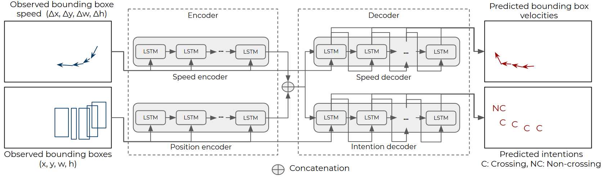

# Pedestrian Intention Forecasting: A Future Bounding Box Prediction Approach

## _Absract_:
In order to be globally deployed, autonomous cars must guarantee the safety of pedestrians. This isthe reason why forecasting pedestrians’ intentions sufficiently in advance is one of the most criticaland challenging tasks for autonomous vehicles.  This work tries to solve this problem by jointlypredicting the intention and visual states of pedestrians. In terms of visual states, whereas previouswork focused on x-y coordinates, we will also predict the size and indeed the whole bounding boxof the pedestrian.  The method is a recurrent neural network in a multi-task learning approach.  Ithas one head that predicts the intention of the pedestrian for each one of its future position andanother one predicting the visual states of the pedestrian. Experiments on the JAAD dataset show thesuperiority of the performance of our method compared to previous works for intention prediction.Also, although its simple architecture (more than 2 times faster), the performance of the boundingbox prediction is comparable to the ones yielded by much more complex architectures.

## Introduction:
This is the official code for the paper "Pedestrian Intention Forecasting: A Future Bounding Box Prediction Approach", to be published in the hEART conference in April 2021.

## Contents
------------
  * [Repository Structure](#repository-structure)
  * [Proposed Method](#proposed-method)
  * [Results](#results)
  * [Installation](#installation)
  * [Dataset](#dataset)
  * [Training/Testing](#training-testing)
  * [Tested Environments](#tested-environments)
  
## Repository structure:
------------
    ├── bounding-box-prediction         : Project repository    
            ├── train.py                : Script for training PV-LSTM.  
            ├── test.py                 : Script for testing PV-LSTM.  
            ├── DataLoader.py           : Script for data pre-processing and loader. 
            ├── networks.py             : Script containing the implementation of the network.
            ├── utils.py                : Script containing necessary math and transformation functions.
            
## Proposed method
-------------



## Results
--------------


  
## Installation:
------------
Start by cloning this repositiory:
```
git clone https://github.com/vita-epfl/bounding-box-prediction.git
cd bounding-box-prediction
```
Create a new conda environment (Python 3.7):
```
conda create -n pv-lstm python=3.7
conda activate pv-lstm
```
And install the dependencies:
```
pip install -r requirements.txt
```

## Dataset:
  * Download the [JAAD clips](http://data.nvision2.eecs.yorku.ca/JAAD_dataset/) (UNRESIZED) and unzip them in the `videos` folder.
  * Clone the dataset's [repository](https://github.com/ykotseruba/JAAD)
  * Run the script `split_clips_to_frames.sh` to convert the JAAD videos into frames. Each frame will be placed in a folder under the `scene` folder. Note that this takes 169G of space.
  
## Training/Testing:
Open `train.py` and `test.py` and change the parameters in the args class depending on the paths of your files.
Start training the network by running the command:
```
python3 train.py
```
Test the trained network by running the command:
```
python3 test.py
```

## Tested Environments:
------------
  * Ubuntu 18.04, CUDA 10.1
  * Windows 10, CUDA 10.1
