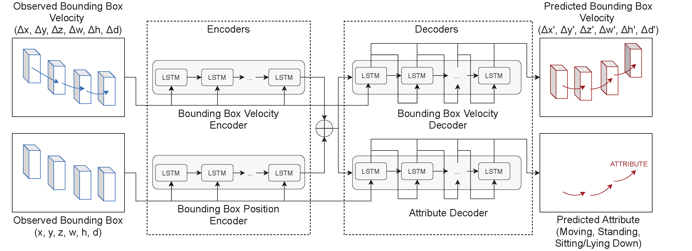

# Pedestrian bounding box prediction library: <br/>
## Introduction:
This is the official code for the papers ["Pedestrian Intention Prediction: A Multi-task Perspective"](https://arxiv.org/abs/2010.10270), accepted and published in [hEART 2021](http://www.heart-web.org/) (the 9th Symposium of the European Association for Research in Transportation) and ["Pedestrian 3D Bounding Box Prediction"](https://arxiv.org/abs/2010.10270), accepted and published in [hEART 2022](http://www.heart-web.org/) (the 10th Symposium of the European Association for Research in Transportation).

### _Absracts_:
> __Pedestrian Intention Prediction: A Multi-task Perspective__<br /> 
> In order to be globally deployed, autonomous cars must guarantee the safety of pedestrians. This is the reason why forecasting pedestrians' intentions sufficiently in advance is one of the most critical and challenging tasks for autonomous vehicles.
> This work tries to solve this problem by jointly predicting the intention and visual states of pedestrians.
> In terms of visual states, whereas previous work focused on x-y coordinates, we will also predict the size and indeed the whole bounding box of the pedestrian.
> The method is a recurrent neural network in a multi-task learning approach. It has one head that predicts the intention of the pedestrian for each one of its future position and another one predicting the visual states of the pedestrian.
> Experiments on the JAAD dataset show the superiority of the performance of our method compared to previous works for intention prediction.
> Also, although its simple architecture (more than 2 times faster), the performance of the bounding box prediction is comparable to the ones yielded by much more complex architectures.

> __Pedestrian 3d Bounding Box Prediction__<br /> 
> Safety is still the main issue of autonomous driving, and in order to be globally deployed, they need to predict pedestrians’ motions sufficiently in advance. 
> While there is a lot of research on coarse-grained (human center prediction) and fine-grained predictions (human body keypoints prediction), we focus on 3D bounding boxes, which are reasonable estimates of humans without modeling complex motion details for autonomous vehicles. 
> This gives the flexibility to predict in longer horizons in real-world settings. We suggest this new problem and present a simple yet effective model for pedestrians’ 3D bounding box prediction. 
> This method follows an encoder-decoder architecture based on recurrent neural networks, and our experiments show its effectiveness in both the synthetic (JTA) and real-world (NuScenes) datasets. 
> The learned representation has useful information to enhance the performance of other tasks, such as action anticipation.


## Contents
------------
  * [Repository Structure](#repository-structure)
  * [Proposed Method](#proposed-method)
  * [Results](#results)
  * [Installation](#installation)
  * [Dataset](#datasets)
  * [Training/Testing](#training-testing)
  * [Tested Environments](#tested-environments)
  

## Repository structure
------------
    |─── datasets                            : Scripts for loading different datasets
            |─── jaad.py
            |─── jta.py
            |─── nuscenes.py
    |─── preprocess                          : Scripts for preprocessing
            |─── jaad_preprocessor.py
            |─── jta_preprocessor.py
            |─── nu_preprocessor.py
            |─── nu_split.py     
    |─── visualization                       : Scripts for visualizing the results  
            |─── visualize.py                       
    ├── train.py                : Script for training PV-LSTM  
    ├── test.py                 : Script for testing PV-LSTM  
    ├── networks.py             : Script containing the implementation of the network
    ├── utils.py                : Script containing necessary math and transformation functions

       
### Proposed method
-------------
Our proposed multitask Position-Speed-LSTM (PV-LSTM) architecture.

*2D bounding box predictions with crossing intention*


*3D bounding box predictions with attribute*


### Results
--------------
Example of outputs

*2D real world JAAD dataset*


*3D synthetic JTA dataset*


*3D real world NuScenes dataset*


## Installation
------------
Start by cloning this repositiory:
```
git clone https://github.com/vita-epfl/bounding-box-prediction.git
cd bounding-box-prediction
```
Create a new conda environment (Python 3.7):
```
conda create -n pv-lstm python=3.7
conda activate pv-lstm
```
And install the dependencies:
```
pip install -r requirements.txt
```


## Datasets
------------
Currently supporting the following datasets:
> 2D: [JAAD] (https://data.nvision2.eecs.yorku.ca/JAAD_dataset/)
> 3D: [JTA](https://aimagelab.ing.unimore.it/imagelab/page.asp?IdPage=25), [NuScenes](https://www.nuscenes.org/nuscenes)

The network __only__ takes bounding box annotations, thus videos and images are only needed for visualization. 

For JAAD and JTA datasets, the preprocessing script first saves files containing all available samples to a ```preprocessed_annotations``` folder (by default created in the dataset's home directory). These files are then used during dataloading to allow for creation of data with different input/output/stride values. \n

However, for nuScenes the final `.csv` data files are generated directly so there will be no `preprocessed_annotations` folder.

### JAAD
  Clone repo and copy over preprocessing file
  ```
  git clone https://github.com/ykotseruba/JAAD
  cd JAAD
  cp jaad_data.py ./bounding-box-prediction/preprocess/
  ```
  Run the preprocessor script, train/val/test ratios must be in [0,1] and their sum should equal 1
  ``` 
  python3 preprocess/jaad_preprocessor.py --data_dir=/path/to/JAAD --train_ratio=0.7 --val_ratio=0.2 --test_ratio=0.1 
  ```
  For visualization, download the [JAAD clips](http://data.nvision2.eecs.yorku.ca/JAAD_dataset/) (UNRESIZED) and unzip them in the `videos` folder. Then, run the script `split_clips_to_frames.sh` to convert the JAAD videos into frames. _NOTE:_ Each frame will be placed in a folder under the `scene` folder. Note that this takes 169G of space.


### JTA
  Clone the repo and preprocess the dataset according to original train/val/test ratios.
  ```
  git clone https://github.com/fabbrimatteo/JTA-Dataset
  python3 preprocess/jta_preprocessor.py --data_dir=/path/to/JTA 
  ```
  For visualization, fownload the full dataset following instructions from the official repository.


### nuScenes
  Clone repo and copy over required folder for preprocessing.
  ```
  git clone https://github.com/nutonomy/nuscenes-devkit
  cd nuscenes-devkit/python-sdk
  cp -r nuscenes/ ../bounding-box-prediction/preprocess/
  ```
  Download the _nuScenes_ dataset from the [official website](https://www.nuscenes.org/download) under the heading _Full dataset (v1.0)_  The full _Trainval_ dataset was used, but _Mini_ dataset is great for quick tests. _NOTE:_ the Test dataset was not used because there are no annotations. 
  
  Preprocess the dataset using custom train/val/test split specified in `split.py`. The version should match the type of dataset used (eg. v1.0-mini). The input and output sizes default to 4 unless otherwise specified.
  ```
  python preprocess/nu_preprocessor.py --data_dir=/path/to/nuscenes --version=v1.0-mini --input=4 --output=4
  ```


## Training/Testing
------------
### CLI
```
required arguments:
  --data_dir        Path to dataset
  --dataset         Dataset name
  --out_dir         Path to store outputs (model checkpoints, logs)
  --task            What task the network is performing, choose between '2D_bounding_box-intention', 
  '3D_bounding_box', '3D_bounding_box-attribute' 
  --input           Sequence input length in frames 
  --output          Sequence output length in frames
  --stride          Sequence stride in frames 

optional arguments:
  --is_3D         Whether the dataset is 3D (default: False)
  --dtype         Data type train/test/val (default: None)
  --from_file     Flag to set whether to load existing csv data (default: None)
  --save          Whether to save loaded data (default: True)
  --log_name      Name for output files (default: None)
  --loader_workers  How many load workers (default: 10)
  --loader_shuffle  Shuffle during loading (default: True)
  --pin_memory      Data loading pin memory (default:False)
  --device          GPU (default: 'cuda')
  --batch_size      Batch size (default: 100)
  --n_epochs        Training epochs (default: 100)
  --hidden_size     Network hidden layer size (default: 512)
  --hardtanh_limit  (default: 100)
  --skip            How many frames to skip, where 1 means use consequtive frames (default: 1)
  --lr              Learning rate (default: 1e-5)
  --lr_scheduler    Whether to use scheduler (default: False)
```

### Examples
Commands for training different datasets:
```
python3 train.py --data_dir=/path/to/JAAD/processed_annotations --dataset=jaad --out_dir=/path/to/output --n_epochs=100 --task='2D_bounding_box-intention' --input=16 --output=16 --stride=16

python3 train.py --data_dir=/path/to/jta-dataset/preprocessed_annotations --data=jta --out_dir=/path/to/output --n_epochs=100 --task='3D_bounding_box' --input=16 --output=16 --stride=32

python3 train.py --data_dir=/path/to/nuscenes --dataset=nuscenes --out_dir=/path/to/output --n_epochs=100 --task='3D_bounding_box-attribute' --input=4 --output=4 --stride=8

```

Test the network by running the command:
```
python3 test.py --data_dir=/path/to/JAAD/processed_annotations --dataset=jaad --out_dir=/path/to/output --task='2D_bounding_box-intention' 
```


## Tested Environments
------------
  * Ubuntu 18.04, CUDA 10.1
  * Windows 10, CUDA 10.1


### Citations

```
@inproceedings{bouhsain2020pedestrian,
title={Pedestrian Intention Prediction: A Multi-task Perspective},
 author={Bouhsain, Smail and Saadatnejad, Saeed and Alahi, Alexandre},
  booktitle = {European Association for Research in Transportation  (hEART)},
  year={2020},
}
```

```
@inproceedings{saadatnejad2022pedestrian,
title={Pedestrian 3D Bounding Box Prediction},
 author={Saadatnejad, Saeed and Ju, Yi Zhou and Alahi, Alexandre},
  booktitle = {European Association for Research in Transportation  (hEART)},
  year={2022},
}
```